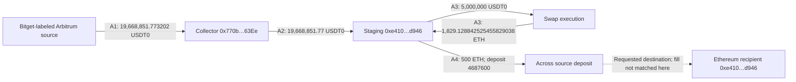

# Bitget | When a transaction row is not a fund flow

**An early, bounded on-chain investigation of the 24 September 2026 incident, with a worked guide for transaction-monitoring analysts.**

The investigation asks a practical question: **what evidence turns a displayed transaction into a delivered payment, a bridge request into a completed transfer, or an address connection into a defensible investigation lead?**

Bitget reported approximately **$351.6 million** affected by unauthorized transfers. That is the company's estimate, not a loss total independently reconstructed here. This release examines selected Arbitrum and XRP Ledger records, plus an Optimism/Ethereum clustering lead. It does not cover every initial outflow. [Official notice](https://www.bitget.com/support/articles/12560603896024).

**Release:** 25 September 2026. Transaction sample ends at 02:55:23 UTC that day; later movements are outside this release. Most explorer checks were performed earlier that morning; selected records were rechecked and screenshots captured during the publication review. See [provenance and limitations](METHOD_AND_LIMITS.md).

## The result

Three evidence distinctions materially change how this sample should be read:

| Finding | Evidence | Consequence for an analyst |
|---|---|---|
| A displayed 9,142,093.8 XRP payment failed; the recorded balance change was only a 0.000020 XRP fee | X4; archived explorer JSON | Adding the requested amount to the three successful external payments would overstate this selected XRP total by **8.88%** |
| A different ERC-20 contract emitted records using the same 19,668,851.77 amount and lookalike addresses | A5 compared with A2 | Amount matching and shortened-address matching can introduce unsupported edges into the graph |
| Two shared Arkham entities had 25 common EVM addresses and one additional address in the larger set | Membership observation; O1 | The additional address has a direct 495.625 WETH receipt worth investigating; the transfer does not establish common ownership |

The 8.88% figure is a **counterfactual accounting error calculated on this selected sample**, not a measured error rate in a commercial tool. No claim is made that Arkham or another provider committed that error. Evidence IDs resolve in the [transaction register](EVIDENCE_REGISTER.md).


*XRPSCAN excerpt captured during publication review. The amount field alone does not describe settlement. The full source URL, hash and capture details are in the [asset register](assets/README.md).*

## Put the $19.67 million example in context

The Arbitrum entry is **19,668,851.773202 USDT0**, a small branch of the incident. Three successful XRP receipts in the sample total **102,976,680.091945 XRP**. Neither figure should be confused with the complete incident loss.

[YFarmX's reconstruction](https://yfarmx.com/bitget-postmortem-2026/) reported $192,611,911.60 across 16 EVM receipts and $158,051,512.55 for three XRP payments, totaling $350,663,424.15 at its stated 24 September 21:39:35 UTC reference prices. The complete EVM basket and valuation were not independently reproduced here. Its provisional 0.84 ETH funding classification also requires review. A separate [Lookonchain asset table](https://x.com/lookonchain/status/2103290466116763936) includes TRX and produces a higher total; valuation and population differences remain unresolved. These estimates cannot be treated as mutual confirmation. [YFarmX evidence index](https://yfarmx.com/media/2026/09/bitget-postmortem-evidence.json).

## Selected paths



The diagram shows selected events, not exhaustive balances. The 500 ETH is an outgoing payment from an account that received swap proceeds; this release does not trace uniquely identifiable units through a potentially commingled balance. Intermediate transfers, swaps, wrapping and bridge payouts must not be added to the initial-loss total.

On XRPL, a failed external payment sits between an internal source-account transfer and a subsequent refill. The later external payment succeeded. Keeping failures in the timeline reveals an investigation question that a success-only view loses: **what authorized the refill, and what changed before the next attempt?** Public transactions show the sequence; internal instructions and signing records would be needed to answer the cause.

## What is distinctive, and what is not

This is an **evidence-quality and investigation-method case**, not a claim to have discovered the hack, identified its perpetrators or recovered funds. The contribution is a linked worked example of settlement checks, graph contamination and conservative clustering, including a reproducible calculation of one possible accounting error.

The XRP 90% amount-pattern hypothesis was first highlighted by **YFarmX**. We rechecked the arithmetic against selected explorer balances; that is replication, not a new discovery. The lookalike-record comparison and entity set comparison are observations made in this investigation, but no exhaustive prior-art search establishes that they were first reported here.

## Read or reproduce

- [Worked investigation: what to inspect, why, and where to stop](WALKTHROUGH.md)
- [Evidence register: 13 selected transactions and their roles](EVIDENCE_REGISTER.md)
- [Method, professional review and unresolved questions](METHOD_AND_LIMITS.md)
- [Monitoring implications and a falsifiable evaluation plan](MONITORING.md)
- [Publication and external-review brief](PUBLICATION_AND_REVIEW.md)

The small offline checker needs Python 3.10+ and no dependencies:

```sh
python scripts/reproduce.py
```

It recomputes the sample arithmetic and checks the archived failed-payment metadata. **It does not query a node or independently authenticate the other explorer observations.** Source URLs and explicit gaps let a reviewer challenge the conclusions without relying on an AI summary.

Related investigations: [Nomad Bridge](https://github.com/DenizErginGunduz/nomad-bridge-case-study) · [WLFI listing decision](https://github.com/DenizErginGunduz/wlfi-listing-case-study).
