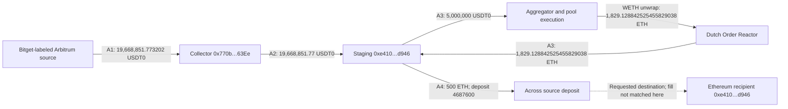

# Bitget incident: settlement, asset identity and address attribution

**An early, bounded on-chain investigation of the 24 September 2026 incident, with a worked guide for transaction-monitoring analysts.**

The investigation asks a practical question: **what evidence turns a displayed transaction into a delivered payment, a bridge request into a completed transfer, or an address connection into a defensible investigation lead?**

Bitget reported approximately **$351.6 million** affected by unauthorized transfers. That is the company's estimate, not a loss total independently reconstructed here. This release examines selected Arbitrum and XRP Ledger records, plus an Optimism/Ethereum clustering lead. It does not cover every initial outflow. [Official notice](https://www.bitget.com/support/articles/12560603896024).

**Study date:** 25 September 2026. The transaction sample ends at 02:55:23 UTC that day. Explorer observations and screenshot collection took place on 25 September; later fund movements are outside the sample. See [provenance and limitations](METHOD_AND_LIMITS.md).

## Results in the selected sample

The selected records support the following conclusions:

| Finding in this sample | Evidence | Consequence for an analyst |
|---|---|---|
| A displayed 9,142,093.8 XRP payment failed; the recorded balance change was only a 0.000020 XRP fee | X4; archived explorer JSON | Adding the requested amount to the three successful external payments would overstate this selected XRP total by **8.88%** |
| A different ERC-20 contract emitted records using the same 19,668,851.77 amount and lookalike addresses | A5 compared with A2 | Amount matching and shortened-address matching can introduce unsupported edges into the graph |
| Two public Arkham label sets had 25 common EVM addresses and one additional address in the larger set | [Archived membership views](data/arkham-entity-membership.json); O1 | The additional address has a direct 495.625 WETH receipt worth investigating; the transfer does not establish common ownership |

The 8.88% figure is a **counterfactual accounting error calculated on this selected sample**, not a measured error rate in a commercial tool. No claim is made that Arkham or another provider committed that error. Evidence IDs resolve in the [transaction register](EVIDENCE_REGISTER.md).


*XRPSCAN observation dated 25 September 2026. The amount field alone does not describe settlement. The full source URL, hash and capture details are in the [asset register](assets/README.md).*

## Incident scale and sample coverage

The Arbitrum entry is **19,668,851.773202 USDT0**, a small branch of the incident. Three successful XRP receipts in the sample total **102,976,680.091945 XRP**. Neither figure should be confused with the complete incident loss.

| Branch | Coverage in this study | Boundary |
|---|---|---|
| Initial Arbitrum receipt | A1: 19,668,851.773202 USDT0 | One EVM entry, not the full EVM outflow population |
| Initial XRP receipts | X1, X2 and X6: 102,976,680.091945 XRP | Matches the three receipts identified by YFarmX; completeness was not established through an independent account-history search |
| Arbitrum disposition | A2 onward transfer; A3 converts 5,000,000 of the 19,668,851.77 USDT0 received | The other 14,668,851.77 USDT0 is outside the traced conversion slice, not asserted to remain held |
| Cross-chain observations | A4 source deposit; E2 destination mint | Neither is presented as a matched source-to-destination bridge path |
| XRP source-account continuity | Eight AccountRoot updates for source 2, from X2 through X6 | Reconciles this account and interval, not the full history of both source wallets |

[YFarmX's reconstruction](https://yfarmx.com/bitget-postmortem-2026/) reported $192,611,911.60 across 16 EVM receipts and $158,051,512.55 for three XRP payments, totaling $350,663,424.15 at its stated 24 September 21:39:35 UTC reference prices. These are attributed context figures; this study does not reproduce that EVM inventory or USD valuation. The difference from Bitget's estimate remains outside the reconciliation performed here. [YFarmX evidence index](https://yfarmx.com/media/2026/09/bitget-postmortem-evidence.json).

## Selected paths



The diagram shows selected events, not exhaustive balances. The 500 ETH is an outgoing payment from an account that received swap proceeds; this release does not trace uniquely identifiable units through a potentially commingled balance. Intermediate transfers, swaps, wrapping and bridge payouts must not be added to the initial-loss total.

On XRPL, a failed external payment sits between an internal source-account transfer and a subsequent refill. The later external payment succeeded. Keeping failures in the timeline reveals an investigation question that a success-only view loses: **what authorized the refill, and what changed before the next attempt?** Public transactions show the sequence; internal instructions and signing records would be needed to answer the cause.

## Interpretation and attribution

The selected records illustrate three distinct analytical tasks: establishing settlement, excluding unsupported graph edges and assessing candidate address relationships. The counterfactual accounting calculation quantifies the effect of one classification error within the sample. It does not measure the prevalence of such errors across the incident or across analytics providers.

The three XRP receipt selections, the classification of X4 as a failed payment, and the 90% amount-pattern hypothesis follow **[YFarmX](https://yfarmx.com/bitget-postmortem-2026/)**. This study checks those observations against archived explorer metadata and makes the accounting consequence reproducible. It also reconciles the intervening small payments and documents the token-contract and label-set comparisons. Its contribution is an auditable worked investigation; no first-discovery or exploit-discovery claim is made.

## Read or reproduce

- [Worked investigation: what to inspect, why, and where to stop](WALKTHROUGH.md)
- [Evidence register: 16 selected transactions and their roles](EVIDENCE_REGISTER.md)
- [Method, evidence boundaries and unresolved questions](METHOD_AND_LIMITS.md)
- [Monitoring implications and a falsifiable evaluation plan](MONITORING.md)
- [Reproduction results](VALIDATION.md)

The small offline checker needs Python 3.10+ and no dependencies:

```sh
python scripts/reproduce.py
```

It recomputes the sample arithmetic, checks archived XRPL result and balance metadata, and compares the archived Arkham label sets. It does not query a node or authenticate explorer responses. The evidence register links each observation to its source transaction.
