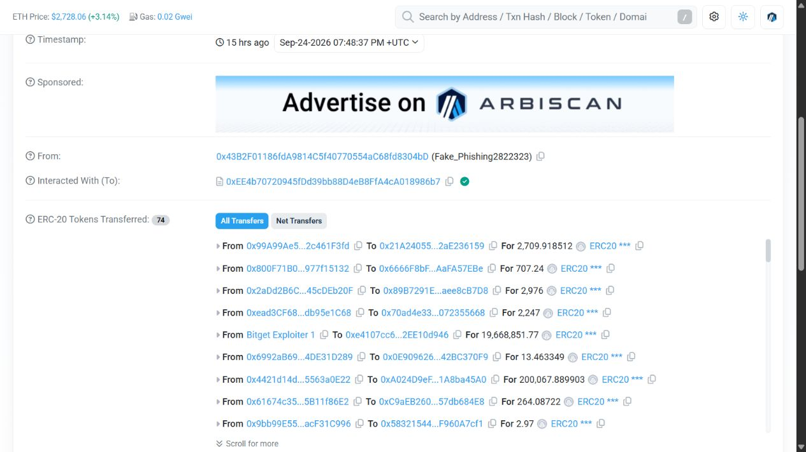
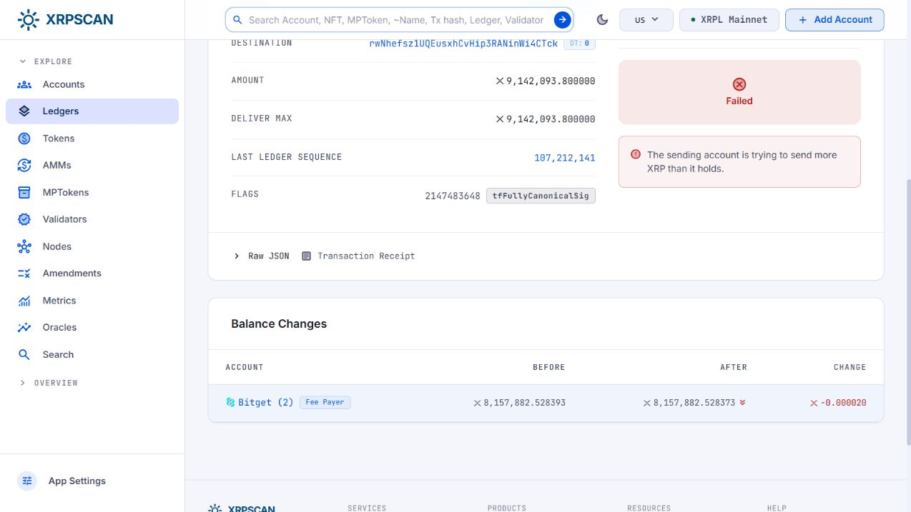

# Worked investigation guide

Read this alongside the [evidence register](EVIDENCE_REGISTER.md). All transaction times below are UTC. Use the linked transaction hashes to reproduce the checks; an explorer's live prices, labels and page layout may change.

## 1. Define the population before drawing the graph

**Question:** Are we counting initial unauthorized outflows, downstream movements, attempted payments or present holdings?

Start with a worksheet that keeps those categories separate. An initial outflow can later appear as a collector transfer, several swaps and a bridge payout. Adding those rows measures repeated turnover of the same funds. An Arkham entity's present portfolio is also affected by subsequent movements, prices and membership choices.

In this release, only A1 and X1/X2/X6 are included as selected initial external receipts. The USD incident estimate comes from Bitget. We have not reconciled the full incident population, all chains or all first recipients. The sample was selected from public leads and manually inspected; it is not random or representative.

**Record:** chain, hash, time, source, recipient, asset identifier, amount, transaction result, role in the timeline, source URL and unresolved interpretation.

## 2. Establish a real token transfer

Open **A1**, then **A2**, in Arbiscan. Check success, UTC time, token contract and full addresses. The USDT0 contract used by both records is:

`0xFd086bC7CD5C481DCC9C85ebE478A1C0b69FCbb9`

A1 records 19,668,851.773202 USDT0 reaching the collector. A2 records 19,668,851.77 reaching the staging address 32 minutes 54 seconds later. The difference is 0.003202 USDT0; its cause is not inferred here. A2 is a continuation, not another loss.

**Why:** A token's displayed name or symbol is insufficient to establish asset identity. The relevant evidence is chain-specific contract identity and the transfer event, together with transaction success. Wallet identity remains a separate label claim.

**Stop condition:** If the contract, recipient or result cannot be established, leave the row unresolved. Do not repair missing evidence with a matching dollar amount.

## 3. Challenge the convincing-looking row

Open **A5**. Its displayed amount matches A2, but its contract is:

`0xEE4b70720945fDd39bb88D4eB8FfA4cA018986b7`

The following full addresses come from the explorer's visible transfer links:

| Role | Actual address in A2 | Lookalike in A5 |
|---|---|---|
| Collector | `0x770b10b273fC44Fe9197D6bF20F145c2e98463Ee` | `0x770b1a3789F71427D4216d19f73DA558503463Ee` |
| Staging | `0xe410a2E5710Ee787bcaa63f52A3943ff71F0d946` | `0xe4107cc60D53C494eb66D9cC478855d2EE10d946` |

*This screenshot is an excerpt, not the complete set of 74 displayed token records. Follow A5 for the second lookalike row and full transaction identity.*

**Why:** A transfer event emitted by another contract is not evidence that canonical USDT0 moved. Even a genuine event log can describe an economically irrelevant asset. Here the appropriate outcome is to exclude these rows from the USDT0 flow graph and preserve them separately as data-quality evidence. The sender's phishing label is an explorer assertion; the contract/address mismatch is the directly inspectable distinction.

**Limit:** This is consistent with address-history contamination. We do not establish its author's intent, ownership or connection to the incident perpetrators. We have not shown that any analytics product misclassified the rows.

## 4. Read a swap from asset movements

Open **A3**. Inspect the token and native-asset movements together. The staging account sends 5,000,000 USDT0 and receives 1,829.128842525455829038 ETH in the same transaction through the execution path. The top-level transaction sender differs from the staging account.

**Why:** A solver or contract may submit a transaction on behalf of an order. Clustering every top-level sender or contract into the investigated party would mix execution infrastructure with the economic parties.

**Record:** each asset leg and its recipient; keep the transaction envelope sender in its own field. One selected execution does not establish total conversion speed, aggregate proceeds or slippage against a historical market benchmark.

## 5. Preserve a bridge's unresolved destination

Open **A4**, then its decoded event logs. The source-side deposit records destination chain 1, deposit ID 4687600, staging address as depositor/recipient, and requested output 499.8760016628046495 WETH for a 500 ETH-equivalent input.

**Why:** A successful source deposit establishes a source event and intended destination. A completed cross-chain path needs the destination execution too. Matching only an approximate amount and nearby timestamp is weak evidence when many transfers use the same bridge.

**Next check:** reconcile the protocol's source-chain/deposit identifiers, recipient, tokens and amounts with the destination fill; inspect partial fills, refunds or changed execution where applicable. Until then the destination edge stays dashed. The observed Circle CCTP mint E2 has a similar boundary: this release has not matched it to a source burn message.

## 6. Separate XRP amount requested from value delivered

Open **X4** in XRPSCAN. Read the outcome before using the amount. The UI says `tecUNFUNDED_PAYMENT`. Expand **Raw JSON** and inspect `meta.TransactionResult` and the modified account's previous and final balances.

The archived explorer representation records a requested 9,142,093.8 XRP but a balance reduction of only 20 drops, or 0.000020 XRP. It contains no destination-account balance increase. Its `validated` flag is an explorer-provided field, not our independent node attestation.

**Why:** Successful partial payments can also differ from the requested amount. The general rule is to check transaction outcome and delivered value/metadata rather than trusting the amount field. See the [XRPL payment-monitoring guidance](https://xrpl.org/docs/concepts/payment-types/robustly-monitoring-for-payments) and [result interpretation](https://xrpl.org/docs/concepts/transactions/finality-of-results/look-up-transaction-results).

X1, X2 and X6 are the selected successful external payments. X3 and X5 move XRP between two Bitget-labeled source accounts. X4 belongs in the behavioral timeline but contributes zero delivered XRP to the external-receipt total. The script reports the overcount that would result from ignoring this distinction.

## 7. Ask what the refill means without claiming its cause

| Time, 24 September | Event | Analyst question |
|---|---|---|
| 19:28:02 | X3: 2,000,000 XRP moves between source accounts | Was this an ordinary treasury instruction? |
| 20:28:20 | X4: external payment fails | What submitted it, and using which balance? |
| 20:40:02 | X5: source receives 2,183,079.516298 XRP | What triggered or approved the refill? |
| 21:19:21 | X6: 9,306,865.8 XRP reaches the external recipient | Did the same workflow or authority submit it? |

The refill precedes the successful payment by 39 minutes 19 seconds. Temporal order alone does not establish that the attacker requested the refill or that a specific control failed.

The [YFarmX hypothesis](https://yfarmx.com/bitget-postmortem-2026/) compares the requested amounts with `floor(balance in XRP) × 0.9`. The arithmetic matches two selected balances. That is a lead for testing stale-balance or repeated-amount logic, not proof of automation. Ordinary treasury operations are a plausible competing explanation requiring a baseline and internal records.

## 8. Audit a cluster before extending it

The two public Arkham entity membership views recorded in the register contained 26 and 25 EVM addresses, with 25 in common. Their difference was `0x2b03476bC4070e3019B3D5f4EC46edC27284ecd8`.

Open **O1**: a shared member sends that address 495.625 WETH on Optimism. This supports a transfer connection and follow-up review. It does not by itself prove common control, criminal intent or a real-world identity. An exchange, router, relayer or independent counterparty can receive value too. The shared entities may also depend on the same original researcher.

**Why:** A cluster is a hypothesis with a provenance trail. Store the reason for each candidate edge and its confidence. Avoid promoting a shared user label into an established fact.

The inspected entities did not include XRPL members. That is a limit of those entity populations, not evidence that the XRP branch is absent or that a paid plan would solve it.

## Suggested six-minute screen-recording sequence

1. **0:00–0:40:** Define the $351.6m context and selected-sample boundary.
2. **0:40–2:00:** Compare A2 with A5; show the full contract and address differences.
3. **2:00–3:20:** Open X4, show failure and fee-only balance change; run the offline arithmetic.
4. **3:20–4:20:** Explain X3–X6, separating observation from the refill hypothesis.
5. **4:20–5:20:** Show A4's source deposit and explain why the destination remains unresolved.
6. **5:20–6:00:** State the contribution, attribution and open questions.

Use a signed-out explorer window and these public transaction URLs. Show no private browser tabs, account menus, notifications, saved notes or API keys. This repository includes still screenshots and a recording plan; it does not contain a screen-recording video.
